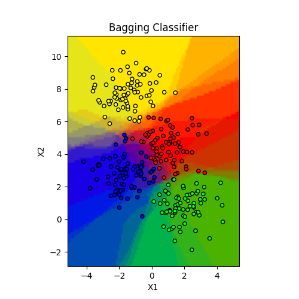
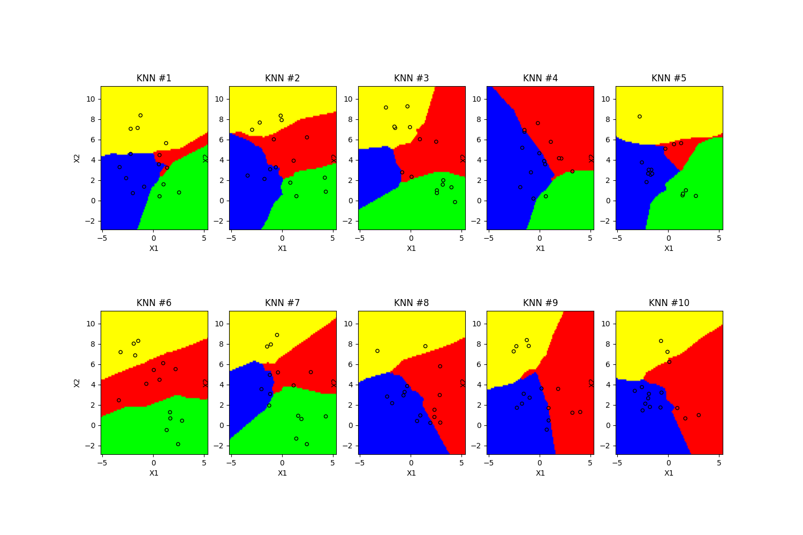

# Clustervis 

[](https://pepy.tech/projects/clustervis) [](https://socket.dev/pypi/package/clustervis)

Clustervis is a Python package for visualizing clustering results from a classifier. 
It provides a visual representation of decision boundaries in the form of a dashboard or as an image.

<div align="center">
  
  
  
</div>

## Features
- Visualize decision boundaries with color-coded cluster regions.
- Visualize statistics such as the probabilities of the data points being in clusters.
- Save the plot in a path as an image (optional).

## Installation

To install Clustervis you can use pip:
```sh
pip install clustervis
```

## Usage

### Dashboard

```python
from sklearn.datasets import make_blobs
from clustervis import run_clustervis_dashboard
import numpy as np

X, y = make_blobs(n_samples=400, centers=5, cluster_std=1.0, random_state=42)

user_colors = np.array([
    [231, 76, 60], [241, 196, 15], [52, 152, 219], [46, 204, 113], [155, 89, 182]
])

run_clustervis_dashboard(X, y, user_colors)
```

### Ensemble classifier (Save enabled)

```python
from clustervis import ensemble_classifier_plot

import matplotlib.pyplot as plt

from sklearn.datasets import make_blobs
from sklearn.ensemble import BaggingClassifier
from sklearn.neighbors import KNeighborsClassifier

# Step 1: Generate synthetic data
X, y = make_blobs(n_samples=300, centers=4, random_state=76, cluster_std=1.0)

# Step 2: Train an ensemble classifier (e.g., a Bagging Classifier)
base_estimator = KNeighborsClassifier(n_neighbors=3)
bagging_classifier = BaggingClassifier(estimator=base_estimator, n_estimators=8, max_samples=0.05, random_state=1)
bagging_classifier.fit(X, y)

# Step 3: Define some colors for each class (e.g., for 4 classes)
colors = [(255, 0, 0), (0, 255, 0), (0, 0, 255), (255, 255, 0)]  # Red, Green, Blue, Yellow

# Step 4: Declare the name, the resolution and the visibility of the plot
plotTitle = 'RGB Clustering Decision Boundaries (Bagging Classifier)'
resolution = 100
show = True

# Step 5: Declare a path to save the plot
plotPath = "/data/notebook_files" # Example path for JetBrains Datalore
fileName = "classifier.png"

# Step 6: Create a figure and a set of axes
fig, ax = plt.subplots()

# Step 7: Plot the decision boundary and save it
ensemble_classifier_plot(X, bagging_classifier, colors, resolution, plotTitle, show, ax, plotPath, fileName)
```

### Base classifier (Save disabled)

```python
from clustervis import base_classifier_plot

import matplotlib.pyplot as plt

from sklearn.datasets import make_blobs
from sklearn.neighbors import KNeighborsClassifier

# Step 1: Generate synthetic data
X, y = make_blobs(n_samples=300, centers=4, random_state=76, cluster_std=1.0)

# Step 2: Train a base classifier (e.g., a KNN Classifier)
base_estimator = KNeighborsClassifier(n_neighbors=3)
base_estimator.fit(X, y)

# Step 3: Define some colors for each class (e.g., for 4 classes)
colors = [(255, 0, 0), (0, 255, 0), (0, 0, 255), (255, 255, 0)]  # Red, Green, Blue, Yellow

# Step 4: Declare the name, the resolution and the visibility of the plot
plotTitle = 'RGB Clustering Decision Boundaries (KNN Classifier)'
resolution = 100
show = True

# Step 5: Create a figure and an axes
fig, ax = plt.subplots()

# Step 6: Declare the percentage of points selected
percentageSelected = 1.0

# Step 7: Plot the decision boundary
base_classifier_plot(X, base_estimator, colors, resolution, plotTitle, show, ax, percentageSelected)
```

## License

This project is licensed under the MIT License.

## Author

- **Antonio De Angelis**  
- **Email:** deangelis.antonio122@gmail.com  
- **PyPI:** [https://pypi.org/project/clustervis/](https://pypi.org/project/clustervis/)