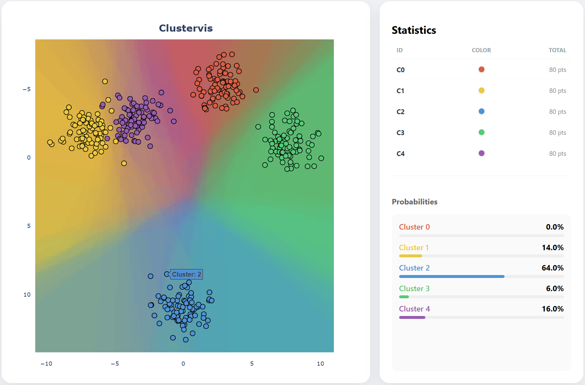
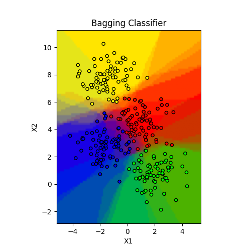
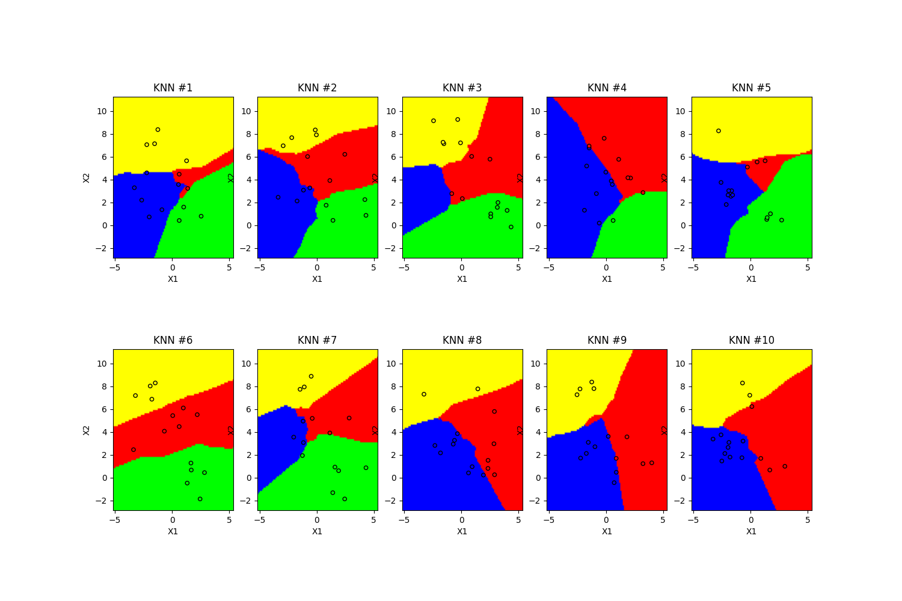

# Clustervis 

[](https://pepy.tech/projects/clustervis) [](https://socket.dev/pypi/package/clustervis)

Clustervis is a Python package for visualizing unsupervised clustering boundaries using surrogate classification models.
It provides a visual representation of decision boundaries in the form of a dashboard or as an image.

<div align="center">
  
  
  
</div>

## Features
- Visualize decision boundaries with color-coded cluster regions.
- Visualize statistics such as the probabilities of the data points being in clusters.
- Save the plot in a path as an image (optional).

## Installation

To install Clustervis you can use pip:
```sh
pip install clustervis
```

## Usage

### Dashboard

```python
from sklearn.cluster import KMeans
from sklearn.datasets import make_blobs

from clustervis import run_clustervis_dashboard

# Step 1: Generate synthetic data (ignoring ground-truth y to simulate unlabeled data)
X, _ = make_blobs(n_samples=400, centers=5, random_state=42, cluster_std=1.0)

# Step 2: Generate unsupervised cluster labels using KMeans
kmeans = KMeans(n_clusters=5, random_state=42)
cluster_labels = kmeans.fit_predict(X)

# Step 3: Declare custom user colors for the clusters
user_colors = [
    [231, 76, 60],
    [241, 196, 15],
    [52, 152, 219],
    [46, 204, 113],
    [155, 89, 182]
]

# Step 4: Run the dashboard using the discovered clusters
run_clustervis_dashboard(X, cluster_labels, user_colors)
```

### Ensemble classifier (Save enabled)

```python
import matplotlib.pyplot as plt
from sklearn.cluster import KMeans
from sklearn.datasets import make_blobs
from sklearn.ensemble import BaggingClassifier
from sklearn.neighbors import KNeighborsClassifier

from clustervis import ensemble_classifier_plot

# Step 1: Generate synthetic data (ignoring ground-truth y to simulate real cluster data)
X, _ = make_blobs(n_samples=300, centers=4, random_state=76, cluster_std=1.0)

# Step 2a: Generate unsupervised cluster labels using KMeans
kmeans = KMeans(n_clusters=4, random_state=42)
cluster_labels = kmeans.fit_predict(X)

# Step 2b: Train the ensemble classifier to map the discovered cluster boundaries
base_estimator = KNeighborsClassifier(n_neighbors=3)
bagging_classifier = BaggingClassifier(
    estimator=base_estimator, n_estimators=8, max_samples=0.05, random_state=1
)
bagging_classifier.fit(X, cluster_labels)  # Fit to cluster_labels instead of y

# Step 3: Define some colors for each cluster
colors = [
    (255, 0, 0),
    (0, 255, 0),
    (0, 0, 255),
    (255, 255, 0)
]  # Red, Green, Blue, Yellow

# Step 4: Declare the name, the resolution and the visibility of the plot
plotTitle = "RGB Clustering Decision Boundaries (Bagging Classifier)"
resolution = 100
show = True

# Step 5: Declare a path to save the plot
plotPath = "../images"  # Example path
fileName = "ensembleClassifier.png"

# Step 6: Create a figure and a set of axes
fig, ax = plt.subplots()

# Step 7: Plot the decision boundary and save it
ensemble_classifier_plot(
    X,
    bagging_classifier,
    colors,
    resolution,
    plotTitle,
    show,
    ax,
    plotPath,
    fileName
)
```

### Base classifier (Save enabled)

```python
import matplotlib.pyplot as plt
from sklearn.cluster import KMeans
from sklearn.datasets import make_blobs
from sklearn.neighbors import KNeighborsClassifier

from clustervis import base_classifier_plot

# Step 1: Generate synthetic data (ignoring ground-truth y to simulate real cluster data)
X, _ = make_blobs(n_samples=300, centers=4, random_state=76, cluster_std=1.0)

# Step 2a: Generate unsupervised cluster labels using KMeans
kmeans = KMeans(n_clusters=4, random_state=42)
cluster_labels = kmeans.fit_predict(X)

# Step 2b: Train a base classifier (e.g., a KNN Classifier) to map the discovered cluster boundaries
base_estimator = KNeighborsClassifier(n_neighbors=3)
base_estimator.fit(X, cluster_labels)  # Fit to cluster_labels instead of y

# Step 3: Define some colors for each cluster (e.g., for 4 clusters)
colors = [
    (255, 0, 0),
    (0, 255, 0),
    (0, 0, 255),
    (255, 255, 0)
]  # Red, Green, Blue, Yellow

# Step 4: Declare the name, the resolution and the visibility of the plot
plotTitle = "RGB Clustering Decision Boundaries (KNN Classifier)"
resolution = 100
show = True

# Step 5: Declare a path to save the plot
plotPath = "../images"  # Example path
fileName = "baseClassifier.png"

# Step 6: Create a figure and an axes
fig, ax = plt.subplots()

# Step 7: Declare the percentage of points selected
percentageSelected = 1.0

# Step 8: Plot the decision boundary and save it
base_classifier_plot(
    X,
    base_estimator,
    colors,
    resolution,
    plotTitle,
    show,
    ax,
    percentageSelected,
    plotPath,
    fileName
)
```

## License

This project is licensed under the MIT License.

## Author

- **Antonio De Angelis**  
- **Email:** deangelis.antonio122@gmail.com  
- **PyPI:** [https://pypi.org/project/clustervis/](https://pypi.org/project/clustervis/)